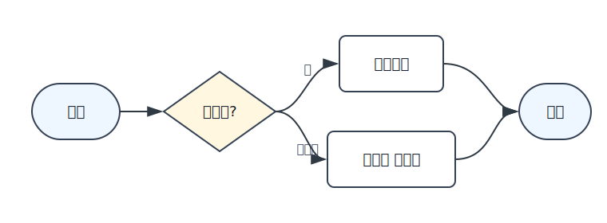

# README.md 파일 작성
## AI를 활용한 백엔드 개발

**진하게**<br>
<br>


<hr>



# 🎨 컬러 계산기 (SimpleCalculator)

Java Swing으로 제작된 **예쁜 GUI 계산기**입니다.  
사용자 친화적인 컬러 디자인과 모달 결과 창, 아이콘 로딩 등을 포함한 교육용/데모용 프로젝트입니다.

 <!-- 실제 이미지가 있으면 이 부분에 넣으세요 -->

## ✨ 주요 기능

- **로그인 화면** (`admin` / `1234` 데모 계정)
- **사칙연산** (`+`, `-`, `*`, `/`)
- **0으로 나누기 방지** 처리
- **예외 처리** (숫자 형식 오류)
- **모달 결과 팝업** 창
- **세련된 컬러 테마** (파스텔 + vibrant 조합)
- **Malgun Gothic** 한글 폰트 지원
- **아이콘 로딩** (`calculator.png`)

## 📁 프로젝트 구조

```bash
SimpleCalculator/
├── src/
│   └── test/
│       └── SimpleCalculator.java     # 메인 클래스 (전체 코드)
├── resources/
│   └── calculator.png                # 계산기 아이콘 (80x80 권장)
├── README.md
└── .gitignore (선택)  
```
